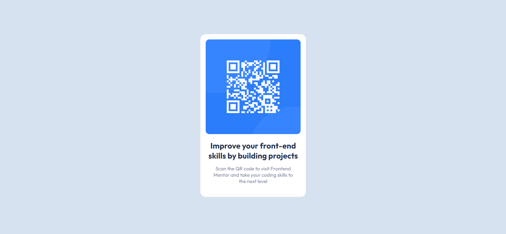

# Frontend Mentor - QR code component solution

This is a solution to the [QR code component challenge on Frontend Mentor](https://www.frontendmentor.io/challenges/qr-code-component-iux_sIO_H). Frontend Mentor challenges help you improve your coding skills by building realistic projects. 

## Table of contents

- [Overview](#overview)
  - [Screenshot](#screenshot)
  - [Links](#links)
  - [Built with](#built-with)
- [Author](#author)

## Overview
  This was my first project with Front-End Mentor. It was a really amazing experience. I got to learn alot from this project.

### Screenshot

### Links

- Solution URL: [Add solution URL here](https://www.frontendmentor.io/solutions/qr-code-component-main-D_GjSvOPA5)
- Live Site URL: [Add live site URL here](https://qr-code-component-main-project.vercel.app/)

### Built with
- HTML5
- CSS3

## Author

- Website - [Ameer Hamza](https://www.instagram.com/ameerhamza.6/)
- Frontend Mentor - [@AmeerHamza838](https://www.frontendmentor.io/profile/AmeerHamza838)
